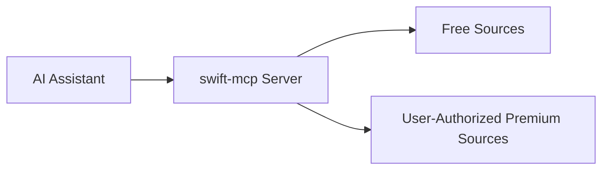

<div align="center">

# swift-mcp

### 🎯 Curated Swift/SwiftUI Patterns from Top iOS Developers

[](https://www.npmjs.com/package/@efremidze/swift-mcp)
[](https://opensource.org/licenses/MIT)
[](https://nodejs.org)

**An MCP server that brings best practices from leading iOS developers directly to your AI assistant.**

> ⚠️ swift-mcp does **not** bypass paywalls or access restricted Patreon content beyond what creators explicitly make available through supported, user-authorized mechanisms.

[Quick Start](#-quick-start) • [Features](#-features) • [Documentation](#-documentation) • [Examples](#-usage-examples) • [Contributing](#-contributing)

</div>

---

## 📖 Table of Contents

* [About](#-about)
* [Features](#-features)
* [Prerequisites](#-prerequisites)
* [Quick Start](#-quick-start)
* [Installation](#-installation)
* [Configuration](#-configuration)
* [Usage Examples](#-usage-examples)
* [Content Sources](#-content-sources)
* [Premium Integration](#-premium-integration-optional)
* [Commands](#-commands)
* [How It Works](#-how-it-works)
* [Troubleshooting](#-troubleshooting)
* [Documentation](#-documentation)
* [Roadmap](#-roadmap)
* [Contributing](#-contributing)
* [License](#-license)
* [Credits](#-credits)

---

## 🎯 About

**swift-mcp** is a Model Context Protocol (MCP) server that provides your AI assistant with access to curated Swift and SwiftUI patterns, best practices, and code examples from top iOS developers and educators.

Whether you're building a new iOS app or looking for solutions to common Swift problems, swift-mcp gives your AI assistant the knowledge to provide expert-level guidance based on real-world patterns from the Swift community.

### Why swift-mcp?

* ✅ **Curated Content** — high-quality patterns from trusted iOS developers
* ✅ **Always Up-to-Date** — automatically refreshed from public feeds
* ✅ **MCP Native** — works with Claude, Cursor, Windsurf, and other MCP clients
* ✅ **Privacy First** — free sources require no authentication
* ✅ **Extensible** — optional premium discovery for creator-supported content

---

## 🌟 Features

### Core Features

* 🎓 Expert Swift & SwiftUI patterns
* 🔍 Intelligent topic-based search
* 🎯 Quality filtering and ranking
* 📚 Aggregation from trusted educators
* 🔄 Automatic updates via RSS
* ⚡ Fast indexed lookup

### Built-in Sources (Free)

* Swift by Sundell
* Antoine van der Lee
* Point-Free (open source)

### Optional Premium Discovery

* Patreon (user-authorized feeds only)
* GitHub Sponsors *(coming soon)*

---

## 📋 Prerequisites

* **Node.js** ≥ 18
* An MCP-compatible client:

  * Claude Desktop
  * Cursor
  * Windsurf
  * Any MCP-compliant agent

---

## 🚀 Quick Start

```bash
npm install -g @efremidze/swift-mcp
```

That’s it — free sources work immediately.

Try asking your AI assistant:

```
"Show me SwiftUI animation patterns"
```

---

## 📦 Installation

### Global Installation (Recommended)

```bash
npm install -g @efremidze/swift-mcp
```

### MCP Client Configuration

#### Cursor

```json
{
  "mcpServers": {
    "swift": {
      "command": "npx",
      "args": ["-y", "@efremidze/swift-mcp@latest"]
    }
  }
}
```

#### Claude Desktop (macOS)

```json
{
  "mcpServers": {
    "swift": {
      "command": "npx",
      "args": ["-y", "@efremidze/swift-mcp@latest"]
    }
  }
}
```

#### Windsurf

```json
{
  "mcpServers": {
    "swift": {
      "command": "npx",
      "args": ["-y", "@efremidze/swift-mcp@latest"]
    }
  }
}
```

---

## 🔧 Configuration

Config file location: `~/.swift-mcp/config.json`

```json
{
  "sources": {
    "sundell": { "enabled": true, "quality": 60 },
    "vanderlee": { "enabled": true, "quality": 60 },
    "pointfree": { "enabled": true, "quality": 60 },
    "patreon": { "enabled": false }
  },
  "cache": {
    "ttl": 86400
  }
}
```

---

## 💡 Usage Examples

```
"Show me SwiftUI animation patterns"
"What does Sundell say about testing?"
"Find async/await examples with code"
```

### With Premium Discovery Enabled

```
"Show me advanced SwiftUI patterns from creators I support"
"Search premium iOS tutorials I have access to"
```

---

## 📚 Content Sources

### Free Sources

| Source              | Creator             | Content             |
| ------------------- | ------------------- | ------------------- |
| Swift by Sundell    | John Sundell        | Articles & patterns |
| Antoine van der Lee | Antoine van der Lee | Tutorials           |
| Point-Free          | Point-Free          | OSS libraries       |

### Premium Discovery (Optional)

| Source          | Access Method         | Notes             |
| --------------- | --------------------- | ----------------- |
| Patreon         | User-authorized feeds | Creator-dependent |
| GitHub Sponsors | OAuth                 | Coming soon       |

---

## 🔐 Premium Integration (Optional)

swift-mcp supports **optional premium content discovery** for creators you already support, using **user-authorized sources** such as RSS feeds and creator-linked resources.

> ⚠️ swift-mcp does **not** bypass Patreon paywalls or access restricted Patreon posts via undocumented APIs.

### Patreon Integration

The Patreon integration enables swift-mcp to **index and search premium Swift/iOS content you already have access to**, when creators make that content available via supported mechanisms.

#### What This Integration Does

* ✅ Indexes user-authorized Patreon RSS feeds (when provided)
* ✅ Associates premium content with supported creators
* ✅ Enables search and filtering within authorized content
* ✅ Merges premium results with free sources

#### What This Integration Does *Not* Do

* ❌ Does not fetch Patreon posts via `/campaigns/{id}/posts`
* ❌ Does not scrape Patreon web pages
* ❌ Does not bypass patron-only restrictions
* ❌ Does not expose content you are not authorized to access

---

## Requirements

* Patreon account
* Optional active creator subscriptions
* Patreon **Creator account** (free, no published page required)
* Your own Patreon OAuth credentials

### Why a Creator Account Is Required

Patreon requires OAuth applications to be registered under a creator account.
You do **not** need to publish content or accept patrons — this is only for generating OAuth credentials.

---

## Setup

```bash
swift-mcp setup --patreon
```

This will:

1. Guide you through OAuth app creation
2. Authenticate your Patreon account
3. Discover available user-authorized feeds
4. Enable premium discovery where supported

---

## ⚠️ Content Access Disclaimer

* Premium content availability depends on what creators expose
* Not all Patreon creators provide RSS or machine-readable feeds
* Results may vary by creator and subscription tier

If content is not explicitly made available by the creator, swift-mcp will **not** surface it.

---

## ⚙️ Commands

```bash
swift-mcp source list
swift-mcp source enable patreon
swift-mcp source disable pointfree
swift-mcp setup
```

---

## 🏗️ How It Works



---

## 🔧 Troubleshooting

### No Premium Results Appearing

* Confirm active subscriptions
* Ensure the Patreon source is enabled
* Re-authenticate if needed:

  ```bash
  swift-mcp auth patreon
  ```
* Some creators do not provide feeds

---

## 🧾 License

MIT License — see [LICENSE](LICENSE)

---

## 🙏 Credits

Created by **Lasha Efremidze**

Inspired by the Swift community and built for MCP-native AI workflows.

---

<div align="center">

**Made with ❤️ for the Swift community**

</div>
